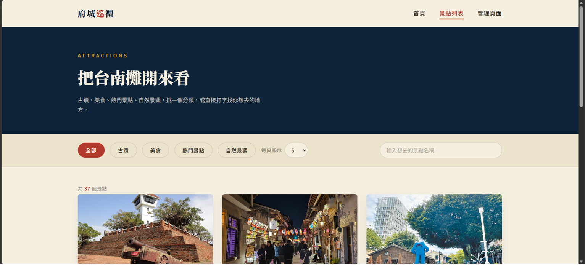
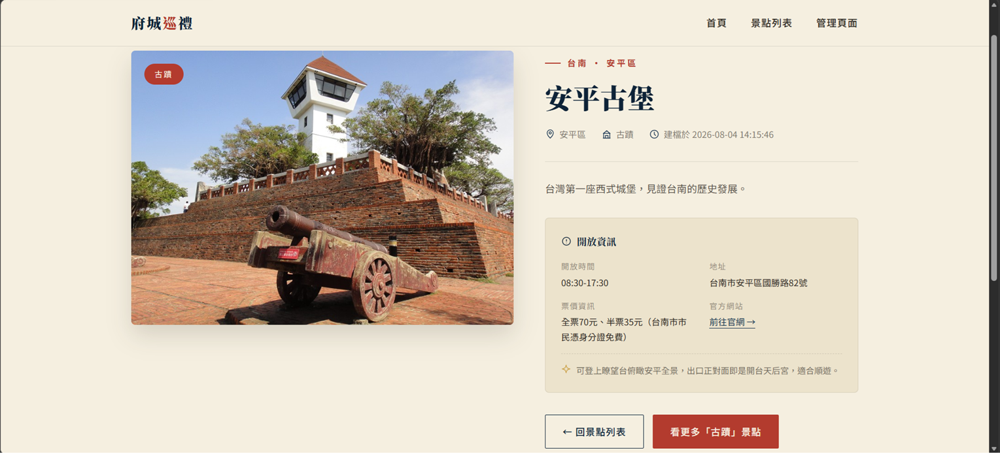
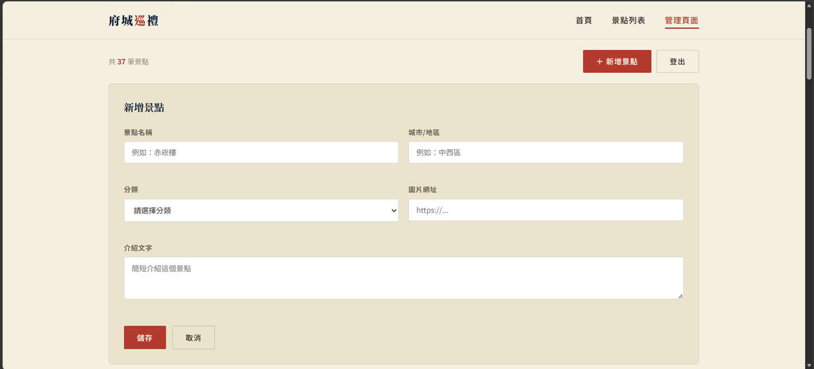
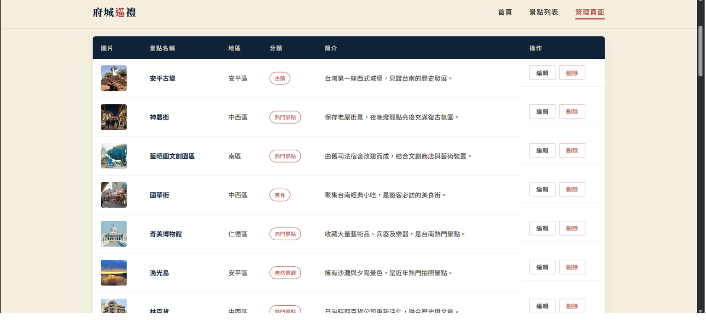
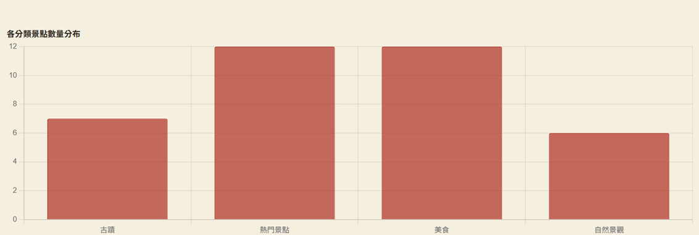
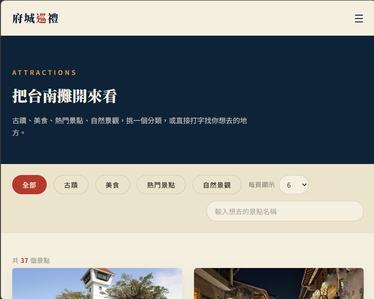
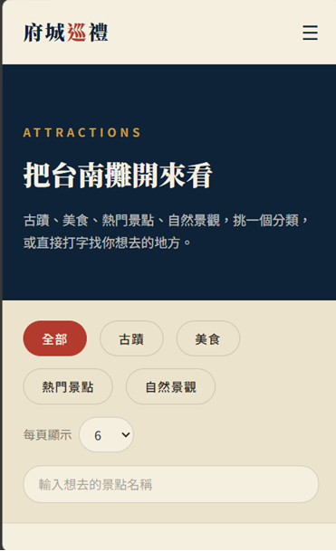

# 台南旅遊巡禮｜AI輔助旅遊景點推薦平台

## 專題簡介

本專題是職訓局結業專題「AI輔助旅遊景點推薦平台」，聚焦台南單一縣市的景點推薦。前端以 jQuery + Ajax 串接自製 Flask API，並用 Vue.js 呈現管理頁的統計圖表；後端使用 Flask 完成景點資料的完整 CRUD，資料庫採 SQLite。

系統可以瀏覽景點列表（分類篩選、關鍵字搜尋、分頁）、查看景點詳細內容（含開放資訊、相關活動）、在管理頁新增／編輯／刪除景點資料，並顯示各分類景點數量統計圖表。管理頁需登入後才能進入。

視覺風格定案為「府城印章風」：米色紙感背景 + 廟宇藍（indigo）+ 朱紅印章元素（vermilion），呼應台南古都主題。

## 使用技術

| 類別 | 技術 |
| --- | --- |
| 前端 | HTML、CSS、jQuery、Vue.js|
| 後端 | Python、Flask |
| 資料庫 | SQLite |
| 設計 | Figma、Google Places API、AI 生成圖像|
| 版本管理 | Git、GitHub |


## 系統功能說明

| 頁面 | 說明 | 截圖位置 |
| --- | --- | --- |
| 首頁（index.html） | 專題介紹與導覽入口 | `docs/screenshots/home.png` |
| 景點列表（attractions1.html） | 卡片呈現景點資料，可用分類（古蹟／美食／熱門景點／自然景觀）篩選、關鍵字搜尋、切換每頁筆數與分頁瀏覽 | `docs/screenshots/attractions.png` |
| 景點詳細（detail1.html） | 左圖右文雙欄式版型，顯示景點圖片、分類、地址、開放時間、票價、官網連結、相關活動，並附圖片輪播 | `docs/screenshots/details.png` |
| 管理頁（admin.html） | 新增／編輯／刪除景點的表單與資料表，需登入後才能進入 | `docs/screenshots/admin1.png`、`docs/screenshots/admin2.png` |
| 統計圖表 | 用 Vue.js 串接真實資料庫資料，呈現各分類景點數量長條圖 | `docs/screenshots/cahrts.png` |

### 專案畫面截圖

#### 首頁


#### 景點列表



#### 景點詳細



#### 管理頁面





#### 統計圖表



### RWD 檢查截圖

#### 桌機寬度 1200px


#### 平板寬度 768px



#### 手機寬度 375px




## 資料庫設計說明

資料庫使用 SQLite，主要資料表如下：

### attractions 景點資料表

| 欄位 | 型別 | 說明 |
| --- | --- | --- |
| id | INTEGER | 主鍵，自動編號 |
| name | TEXT | 景點名稱 |
| district | TEXT | 所在行政區 |
| category | TEXT | 分類（古蹟／美食／熱門景點／自然景觀） |
| image_url | TEXT | 圖片網址 |
| description | TEXT | 景點介紹文字 |
| created_at | TEXT | 建立時間 |

### attraction_details 景點詳細資訊表（關聯表）

| 欄位 | 型別 | 說明 |
| --- | --- | --- |
| id | INTEGER | 主鍵 |
| attraction_id | INTEGER | 對應 `attractions.id` |
| opening_hours | TEXT | 開放時間 |
| address | TEXT | 詳細地址 |
| ticket_info | TEXT | 票價資訊 |
| official_url | TEXT | 官方網站連結 |
| tips | TEXT | 小提醒 |

### attraction_events 景點活動表（關聯表）

| 欄位 | 型別 | 說明 |
| --- | --- | --- |
| id | INTEGER | 主鍵 |
| attraction_id | INTEGER | 對應 `attractions.id` |
| event_name | TEXT | 活動名稱 |
| event_date | TEXT | 活動日期 |
| event_description | TEXT | 活動說明 |

### 資料表關聯

`attraction_details` 與 `attraction_events` 皆以 `attraction_id` 對應 `attractions.id`，為一對一／一對多關聯；景點詳細頁透過後端 JOIN 查詢，一次取回景點基本資料、詳細資訊與相關活動。


## API 說明

| 方法 | 路徑 | 功能 |
| --- | --- | --- |
| GET | `/attractions` | 查詢景點列表 |
| GET | `/attractions/<id>` | 查詢單一景點詳細資料（含 details、events） |
| POST | `/attractions` | 新增景點 |
| PUT | `/attractions/<id>` | 修改景點（完整更新） |
| PATCH | `/attractions/<id>` | 修改景點（部分欄位更新） |
| DELETE | `/attractions/<id>` | 刪除景點 |


## AI 功能說明

專題名稱包含「AI輔助」，AI 輔助的部分包括：

- 景點圖片：40 筆景點資料優先使用 Google Places API 取得現成真實照片，缺圖或需要補充素材的景點再用 AI 生成圖像。
- 景點內容:景點的文案與開放資訊等全部內容皆由chatgpt生成
- 分類建議:古蹟、美食、自然景觀、熱門景點

## 測試紀錄

| 日期 | 測試項目 | 測試方法 | 結果 |
| --- | --- | --- | --- |
|2026-08-09 | Flask API 語法檢查 |執行py app.py |通過 |
|2026-08-09 | 景點列表 CRUD 測試 | 呼叫 DELETE/attractions/2|景點資料刪除成功 |
|2026-08-09 | 管理頁登入攔截測試 |點擊管理頁面 |跳回login.html |


## 安裝與執行方式

1. 建立虛擬環境

```
python -m venv .venv
```

2. 安裝套件

```
.venv\Scripts\python -m pip install -r requirements.txt
```

3. 啟動 Flask

```
.venv\Scripts\python app.py
```

4. 開啟網站

```
http://127.0.0.1:5000
```


## 開發者資訊

| 項目 | 內容 |
| --- | --- |
| 開發者 |Liang|
| 專題名稱 | AI輔助旅遊景點推薦平台（台南旅遊巡禮） |
| GitHub Repository |https://github.com/flag78631-bot/userpage|
